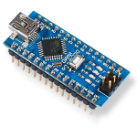
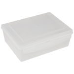
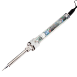
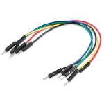
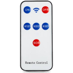

# 3-IN-1 Robotic Car with Arduino Nano
<p align="center">
  
</p>

## Introduction
### About this project
My first Arduino project. This is a four-wheel car with 3 modes:
- Auto: Obstacle avoiding
- Manual: Bluetooth controlling
- Manual: Infrared controlling

Unlike many tutorials on the internet, I build my robot to stop automatically without having to press any `stop button`. If I want the robot to run, I'll just hold the button on the controller and release it when i don't want to. Therefore, the robot become easier to control o.<

### DEMO
#### Obstacle Avoiding
<p align="center">
  
</p>

#### Bluetooth Controlling
<p align="center">
  
</p>

#### IR Controlling
<p align="center">
  
</p>

## Components and Supplies
| Image                                      | Name                        | QTY |
|--------------------------------------------|-----------------------------|-----|
|     | Arduino Nano                | 1   |
|            | L298N - Motor Driver        | 1   |
|         | 3-6V DC motor and wheel     | 4   |
|             | SG90 - Micro Servo Motor    | 1   |
|          | HC-SR04 - Ultrasonic Sensor | 1   |
|            | HC-06 - Bluetooth module    | 1   |
|           | KY-022 - IR Receiver Sensor | 1   |
|  | Mini breadboard             | 1   |
|              | Plastic box                 | 1   |

## Necessary tools
| Image                                      | Name                    |
|--------------------------------------------|-------------------------|
|  | Kid's engineering kit   |
|   | Soldering iron          |
|         | Hot glue gun            |
|     | Jumper wires            |
|         | Infrared remote control |

Notes:
- I only use the short L-shape bracket in the engineering kit. You can buy a mounting bracket for ultrasonic sensor, which is way better :3
- You can use any IR remote, just make sure to edit the buttons' hex value in the code before uploading it to Arduino. I use the remote shown above and its hex codes are:
```c
#define ON    0xFFA25D
#define OFF   0xFFE21D
#define MODE1 0xFFE01F
#define MODE2 0xFFA857
#define MODE3 0xFF906F
#define SOS   0xFF18E7
#define HOLD  0xFFFFFFFF // Generally, remote will send this value when you're holding a button
```
### How to exactly know the hex codes?
Connect IR receiver module with Arduino like this


Then plug in the USB cable to upload the code. 
```c
#include <IRremote.h>

#define RECV_PIN 2 // Specifying the pin connected to receiver module
IRrecv irrecv(RECV_PIN);
decode_results button;

void setup(){
	Serial.begin(9600);
	irrecv.enableIRIn(); // Initialization to receive IR signals 
}

void loop(){
	if(irrecv.decode(&button)){ // Store decoded signal in `button`, return 0 if nothing is received		
		Serial.println(button.value); // Print the value to the serial monitor
		irrecv.resume();
	}
}
```
On Arduino IDE, go to `Tools` -> `Serial Monitor` (or press Ctrl+Shift+M) then press the buttons on the remote respectively to get their Hex values on the monitor.

## App
- Arduino IDE
- Any Arduino bluetooth controller app. 

  I chose [Arduino Bluetooth Controlled Joystick](https://play.google.com/store/apps/details?id=uncia.robotics.joystick). Besides two joystick modes and one accelerometer mode, this app provides `Button Mode` - the mode i'm using in this project. I use the default setting in the app:
  
  | Button      | Symbol | Character send |
  |:-----------:|:------:|----------------|
  | Up arrow    | ˄      | N              |
  | Down arrow  | ˅      | S              |
  | Left arrow  | ˂      | W              |
  | Right arrow | ˃      | E              |
  | Cross       | X      | 1              |
  | Circle      | O      | 2              |
  | Triangle    | Δ      | 3              |
  | Square      | □      | 4              |

## Schematic

